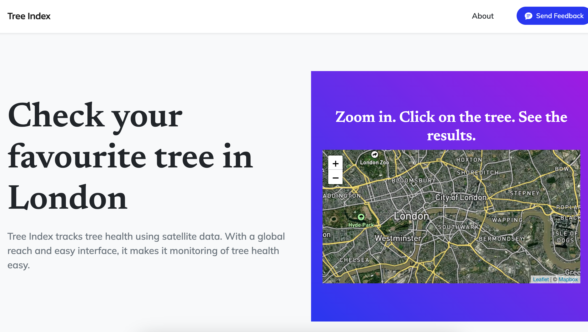
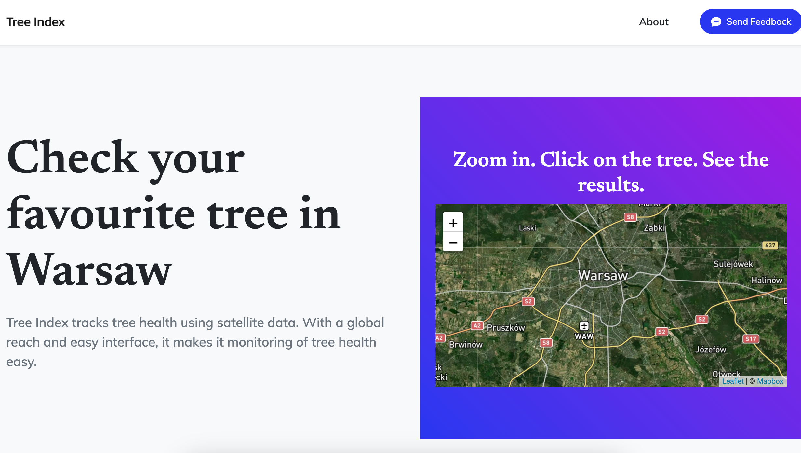
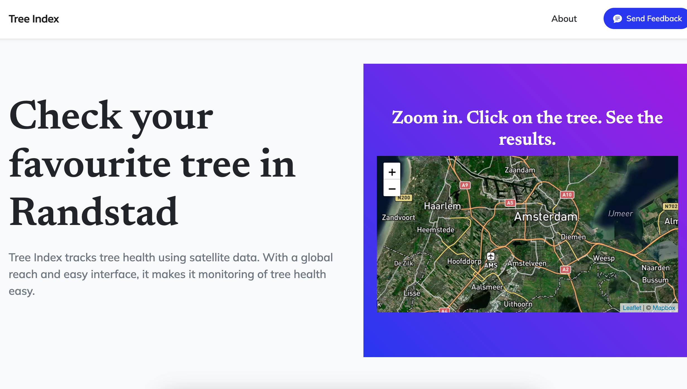
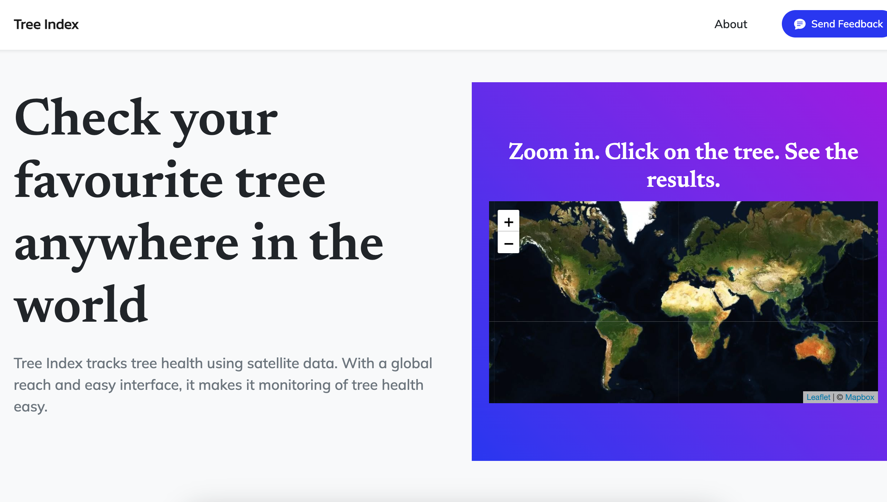
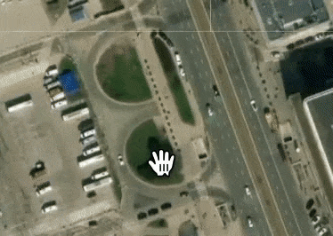
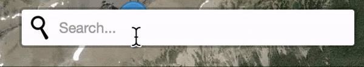
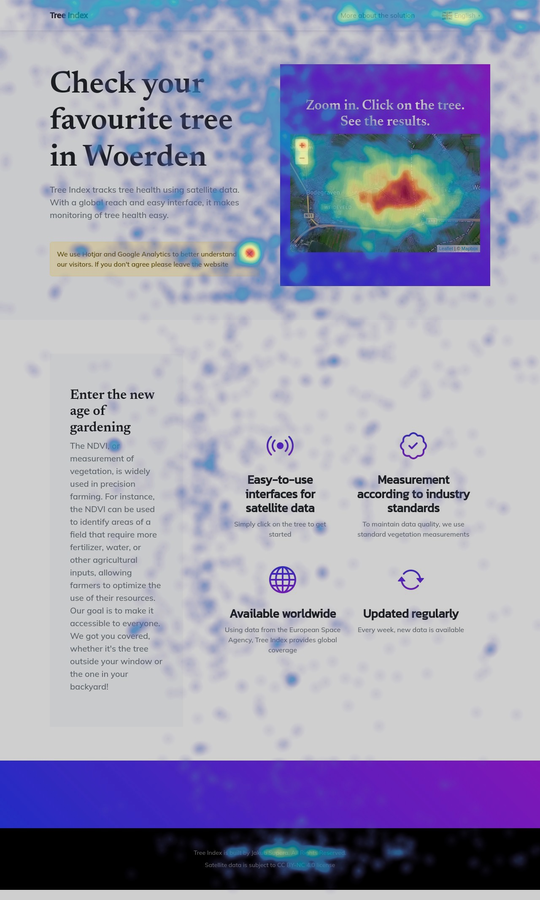

# Tree Index — Satellite Data Platform for Vegetation Anomaly Detection

> Founder & Data Engineer · Amsterdam · 2022–2023

---

## What It Does

Tree Index is a web platform that processes ESA Sentinel Hub satellite imagery to detect anomalies in vegetation health indices (NDVI and related) across user-defined geographic areas. Users select a location, the system fetches and processes the relevant satellite data, runs anomaly detection, and returns a visual, actionable result.

**80 users across 13 countries within 2 weeks of launch — zero marketing budget.**

---

## Architecture

```
Sentinel Hub API → GeoTIFF processing → NDVI computation → Anomaly detection → Web portal
```

**Data ingestion**
- Authentication and data requests via Sentinel Hub OAuth2
- GeoTIFF satellite imagery fetched per user-selected polygon
- Coordinate handling via GeoPy + Shapely

**Processing**
- GeoTIFF → NumPy/GeoPandas raster processing
- NDVI and vegetation index computation
- Time series anomaly detection using Prophet
- Nearest-neighbour lookup for location-to-satellite-tile matching

**Frontend**
- Flask web app with interactive map (Leaflet/OpenStreetMap)
- Click-to-polygon area selection (`clickmap.js`)
- Results visualised on map overlay

---

## Stack

| Layer | Technology |
|-------|-----------|
| Satellite data | ESA Sentinel Hub API |
| Geospatial | GeoPandas, Shapely, GeoPy, GeoTIFF |
| ML / time series | Prophet, NumPy |
| Backend | Python, Flask |
| Frontend | HTML, JavaScript, Leaflet, OpenStreetMap |
| Visualisation | Plotly, Streamlit |

---

## Key Files

| File | Description |
|------|-------------|
| `app.py` | Main Flask application, Sentinel Hub auth, routing |
| `TI_12_2022.ipynb` | Core processing pipeline — GeoTIFF → NDVI → anomaly detection |
| `FromTIFFtoDb.ipynb` | GeoTIFF ingestion and database storage |
| `geotif,_output,_closest.ipynb` | Nearest tile lookup and output processing |
| `Improvement.ipynb` | Iteration on detection accuracy |
| `clickmap.js` | Interactive polygon selection on map |
| `Tree Index - May '23 - 10 slides.pdf` | Product pitch deck (May 2023) |

---

## Screenshots

| London | Warsaw |
|--------|--------|
|  |  |

| Amsterdam region | Global reach |
|--------|--------|
|  |  |

### Demo

 

### User engagement (Hotjar heatmap — real traffic)



---

## Business Context

Tree Index grew out of BOOMBRIX — where ground sensor data was correlated with NDVI satellite indices. The insight was that satellite data alone, processed correctly, could serve a much broader audience than IoT hardware ever could.

The platform launched in late 2022 and reached users in 13 countries within two weeks, validating both the technical approach and the demand for accessible vegetation monitoring tools.
