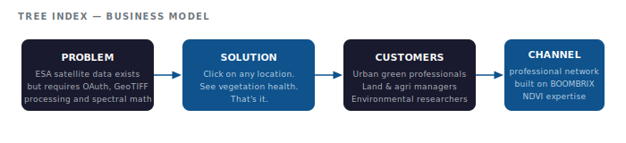
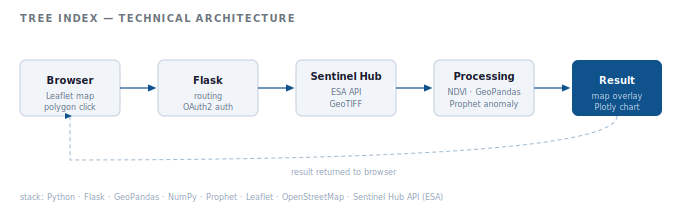

# Tree Index — Satellite Vegetation Intelligence, Made Accessible

> Founder & Data Engineer · Amsterdam · 2022–2023

---

Satellite data from the European Space Agency updates every week and covers every tree on the planet. But accessing it required technical knowledge most people don't have — authentication flows, GeoTIFF processing, coordinate systems, spectral band math.

Tree Index removed all of that. Click on a location. See the health of the vegetation. That's it.

**80 users across 13 countries within 2 weeks of launch. No marketing budget. Pure professional word-of-mouth.**

---

## Business Model



---

## Technical Architecture



---

## What It Does

An end-to-end platform ingesting ESA Sentinel Hub satellite imagery, computing vegetation health indices (NDVI), running ML-based anomaly detection on time series data, and serving results through an interactive web portal — all triggered by a single click on a map.

```
Sentinel Hub API → GeoTIFF processing → NDVI computation → Anomaly detection → Web portal
```

---

## Who It's For

Professionals working with urban green space, agriculture, land management, and environmental monitoring — people who understood the value of satellite vegetation data but lacked the technical pipeline to use it.

The 13-country reach in two weeks wasn't accidental. It spread through professional networks where this problem was already felt.

---

## Recognition

- Pitched at **Copernicus Masters Prize — The Netherlands** (ESA, August 2023)
- 80 users across 13 countries within 2 weeks of launch — professional word-of-mouth only

## Why It Worked

Tree Index was built on top of the insight from BOOMBRIX — that ground-truth sensor data and satellite NDVI indices tell different parts of the same story. Understanding both made it possible to build a platform that interpreted satellite data in ways that were actually meaningful to end users, not just technically correct.

---

## Stack

| Layer | Technology |
|-------|-----------|
| Satellite data | ESA Sentinel Hub API |
| Geospatial | GeoPandas, Shapely, GeoPy, GeoTIFF |
| ML / time series | Prophet, NumPy |
| Backend | Python, Flask |
| Frontend | HTML, JavaScript, Leaflet, OpenStreetMap |

---

## Screenshots

| London | Warsaw |
|--------|--------|
|  |  |

| Amsterdam region | Global reach |
|--------|--------|
|  |  |

### Demo

 

### User engagement (Hotjar heatmap — real traffic)


