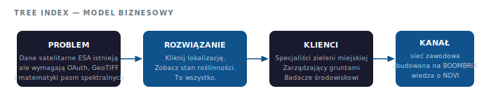

# Tree Index — Inteligentna analiza roślinności z satelity, dostępna dla każdego

> Założyciel & Data Engineer · Amsterdam · 2022–2023

---

Dane satelitarne Europejskiej Agencji Kosmicznej aktualizują się co tydzień i obejmują każde drzewo na planecie. Ale żeby z nich skorzystać, trzeba było znać przepływy autoryzacji OAuth, przetwarzanie GeoTIFF, układy współrzędnych i matematykę pasm spektralnych.

Tree Index usunął wszystkie te bariery. Kliknij w lokalizację. Sprawdź stan roślinności. To wszystko.

**80 użytkowników z 13 krajów w ciągu 2 tygodni od uruchomienia. Bez budżetu marketingowego. Wyłącznie przez profesjonalny word-of-mouth.**

---

## Model biznesowy



---

## Architektura techniczna


---

## Co robi

Platforma end-to-end pobierająca dane satelitarne ESA Sentinel Hub, obliczająca wskaźniki zdrowia roślinności (NDVI), uruchamiająca wykrywanie anomalii ML na danych szeregów czasowych i prezentująca wyniki przez interaktywny portal — wszystko uruchamiane jednym kliknięciem na mapie.

```
Sentinel Hub API → przetwarzanie GeoTIFF → obliczanie NDVI → wykrywanie anomalii → portal
```

---

## Dla kogo

Profesjonaliści pracujący z zielenią miejską, rolnictwem, zarządzaniem gruntami i monitoringiem środowiskowym — osoby, które rozumiały wartość satelitarnych danych o roślinności, ale nie miały technicznego zaplecza, żeby je wykorzystać.

Zasięg 13 krajów w dwa tygodnie nie był przypadkowy. Platforma rozeszła się przez sieci zawodowe, w których ten problem był już odczuwalny.

---

## Uznanie

- Pitch na **Copernicus Masters Prize — Holandia** (ESA, sierpień 2023)
- 80 użytkowników z 13 krajów w 2 tygodnie — wyłącznie przez sieci zawodowe

## Dlaczego to zadziałało

Tree Index powstał na bazie wiedzy wyniesionej z BOOMBRIX — że dane naziemne z czujników i satelitarne wskaźniki NDVI opowiadają dwie różne części tej samej historii. Zrozumienie obu pozwoliło zbudować platformę, która interpretowała dane satelitarne w sposób naprawdę użyteczny dla końcowych użytkowników, a nie tylko technicznie poprawny.

---

## Stack

| Warstwa | Technologia |
|---------|-------------|
| Dane satelitarne | ESA Sentinel Hub API |
| Geospatial | GeoPandas, Shapely, GeoPy, GeoTIFF |
| ML / szeregi czasowe | Prophet, NumPy |
| Backend | Python, Flask |
| Frontend | HTML, JavaScript, Leaflet, OpenStreetMap |

---

## Screenshoty

| Londyn | Warszawa |
|--------|----------|
|  |  |

| Region Amsterdam | Zasięg globalny |
|--------|--------|
|  |  |

### Demo

 

### Zaangażowanie użytkowników (heatmapa Hotjar — rzeczywisty ruch)


